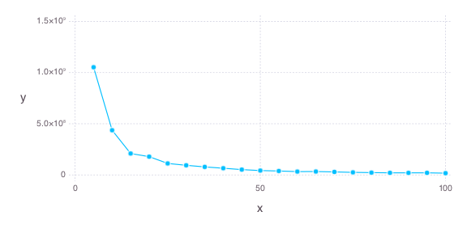

# ConClustJL
Contig Clustering in Julia
Geoffrey Hannigan

# Objective
This is a repo for playing around with Julia and trying to build up a contig clustering program that runs accurately as well as quickly across large datasets.

Run using the following command to obtain the cost associated with each iterative cluster size.

`./bin/conclust.jl -f ./testdata/contigs.fa -a ./testdata/coverage_table.tsv -o ./testdata/clusterplot.png`

